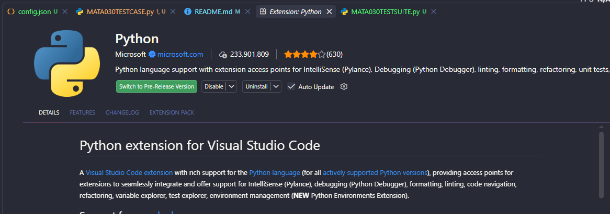
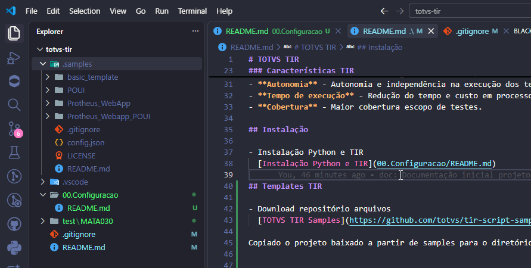
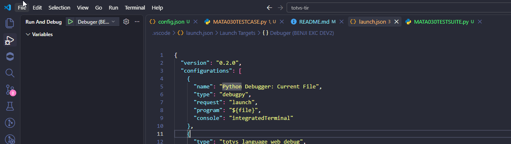
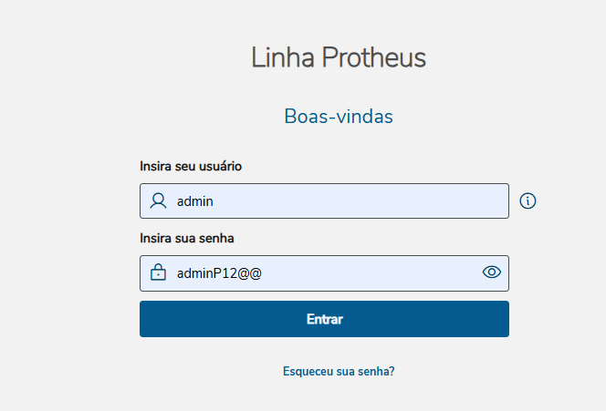
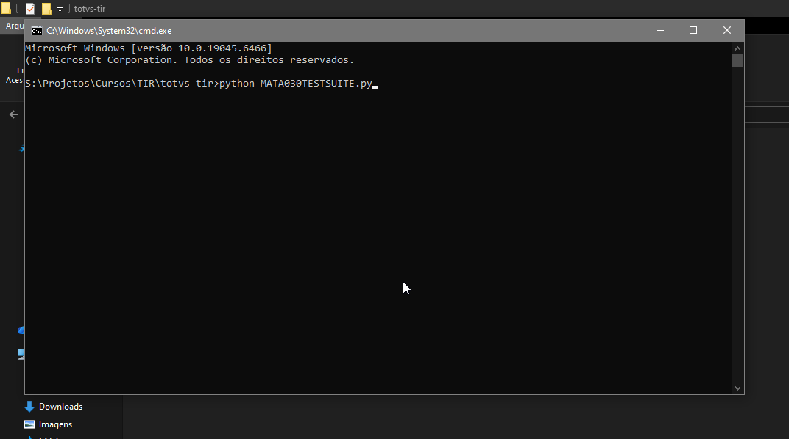
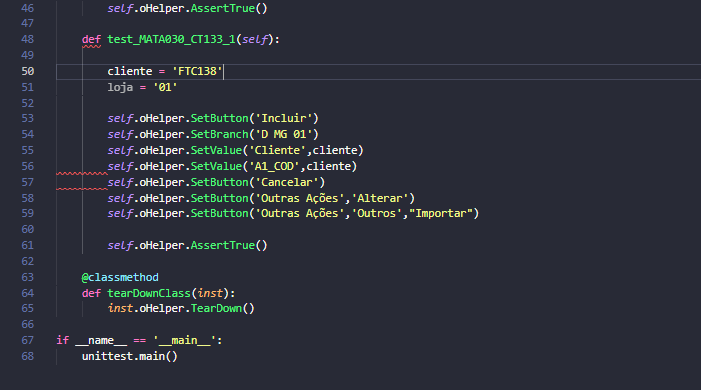
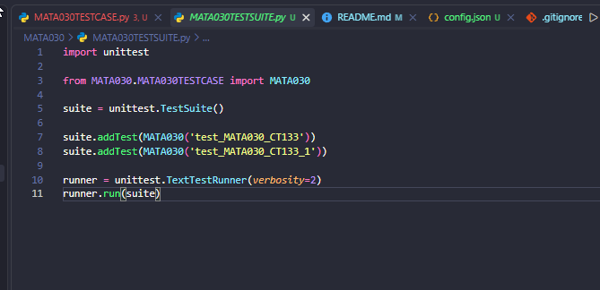
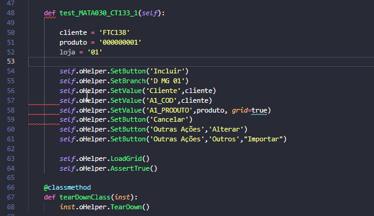
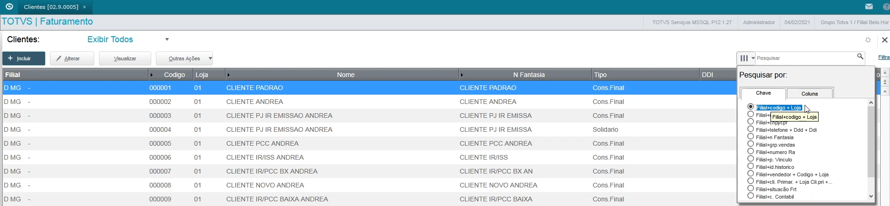
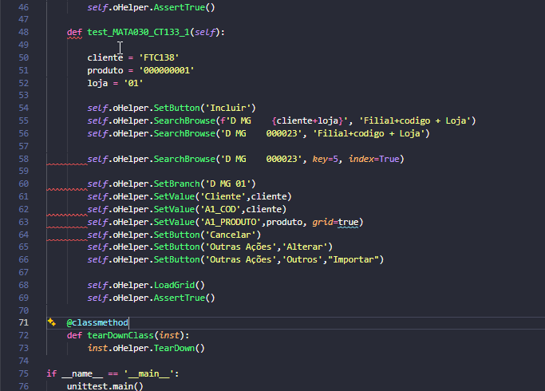

# TOTVS TIR

Projeto desenvolvido focado nos testes automatizados via TIR a partir da Universidade TOTVS

- Valida��o de funcionamento de customiza��es;
- Manuten��o e inova��es usados para novos desenvolvimentos;
- Documenta��o de processos de testes;

### Automa��o de testes

Uso de software para controle e configura��o de testes, iniciando de uma rotina j� existente e otimizando o processo de execu��o, reduzindo o tempo de homologa��o e garantindo o funcionamento da rotina.

### Otimiza��o do processo

Considerando o processo de testes como um todo, sendo:

- Caso de testes;
- Setup de dados;
- Teste Manual;
- **Automa��o de testes; - (Exec. dos testes)**
- **An�lise de resultados. (Exec. dos testes)**

### Caracter�sticas TIR

TOTVS INTERFACE ROBOT � um framework desenvolvimento em Python, criando script testes, baseado em Selenium, em interface Web e justamente fazendo a integra��o com o WebApp do Protheus.

Vantagens e motivos para uso:

- **Classe Protheus** - Classe criada e mantida pela TOTVS com suporte a fun��es, componentes do Protheus;
- **Execu��o** - Execu��o em navegador e headless;
- **Autonomia** - Autonomia e independ�ncia na execu��o dos testes.
- **Tempo de execu��o** - Redu��o do tempo e custo em processo de homologa��o.
- **Cobertura** - Maior cobertura escopo de testes.

## Instala��o

- Instala��o Python e TIR
  [Instala��o Python e TIR](00.Configuracao/README.md)

- Instala��o Extens�o Python VSCode: **Necess�rio para execu��o dos scripts**



## Templates TIR

- Download reposit�rio arquivos
  [TOTVS TIR Samples](https://github.com/totvs/tir-script-samples)

Copiado o projeto baixado a partir de samples para o diret�rio do projeto.





#### Testes

Feito a cria��o do diret�rio para os testes da rotina padr�o **"MATA030 - Cadasstro Cliente"** e salvas em um diret�rio especifico do projeto.

- Download e configura��o [TOTVS WebApp](https://tdn.totvs.com/display/tec/WebApp+-+Configurando+nativamente+o+Application+Server+como+servidor+Web)



Necessário somente realizar as alterações de acordo com o seu ambiente:

Versão inicial:

```json
{
  "Url": "http://localhost:2023",
  "Browser": "Firefox",
  "Environment": "ENVIRONMENT",
  "Language": "pt-br",
  "User": "ADMIN",
  "Password": "1234",
  "Headless": true,
  "POUILogin": false,
  "NewLog": true,
  "MotExec": "HOMOLOGAÇÃO_TIR",
  "ExecId": "20201007",
  "LogUrl1": "http://localhost:8198/log/"
}
```

Versão final:

```json
{
  "Url": "http://localhost:4321",
  "Browser": "Firefox",
  "Environment": "P1212510",
  "Language": "pt-br",
  "User": "ADMIN",
  "Password": "adminP12@@",
  "Headless": true /*Define a exibição do Browser durante os testes*/,
  "POUILogin": false,
  "NewLog": true,
  "MotExec": "HOMOLOGAÇÃO_TIR",
  "ExecId": "20201007",
  "LogUrl1": "http://localhost:8198/log/"
}
```

Arquivos:

- **TESTSUITE** - Configuração trilha de testes.

- **TESTCASE** - Definição parâmetros para cada trilha de testes, instância e preparação de ambientes como Módulos, Filial e Rotina.
- **test_MATA030_CT133** - Script de testes inicial, podendo ser alterado.
- **test_MATA030_CT133_1** - Script de testes com manipulação de valores.

Testes via CMD:



### Definição valores via testes automatizados

Variando de acordo com a necessidade do script de testes é possível realizar a manipulação de valores e botões das rotinas, sendo:

- **SetButtton** - Definição de botão como "Incluir" podendo ter mais de uma instrução como 'Outras Ações','Outros',"Importar";
- **SetValue** - Definição valor campo via Descrição ou campo Protheus como "C5_TIPO".
  - **grid=true** - Definição valor campo via grid, sendo via Descrição ou campo Protheus como "C5_TIPO".
  - **self.oHelper.LoadGrid()** - Necessário para o carregamento dos valores definidos via grid.







- **SearchBrowse** - Definição e atribuição valor pesquisa Protheus ou índice para posicionamento de registros, sendo informado pela chave por extenso ou número do índice, como exemplo:
- **Filial+Codigo+Loja** ou **"1"** - Referente ao Índice 1.





---

### Refer�ncias

**Test Interface Robot?**: https://totvs.github.io/tir/
**GitHub TOTVS TIR**: https://github.com/totvs/tir
**GitHub TOTVS TIR Samples**: https://github.com/totvs/tir-script-samples

**TOTVS WebApp**: https://tdn.totvs.com/display/tec/WebApp+-+Configurando+nativamente+o+Application+Server+como+servidor+Web

**Chrome for Testing availability**: https://googlechromelabs.github.io/chrome-for-testing/#stable

---

```
        Desenvolvido e documentado por: Cristian Gustavo
        Data: 26/08/2026
```
